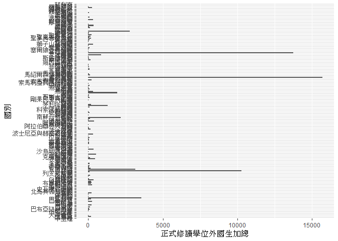
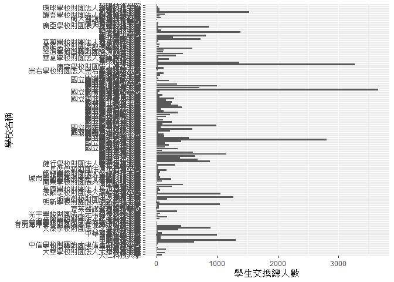
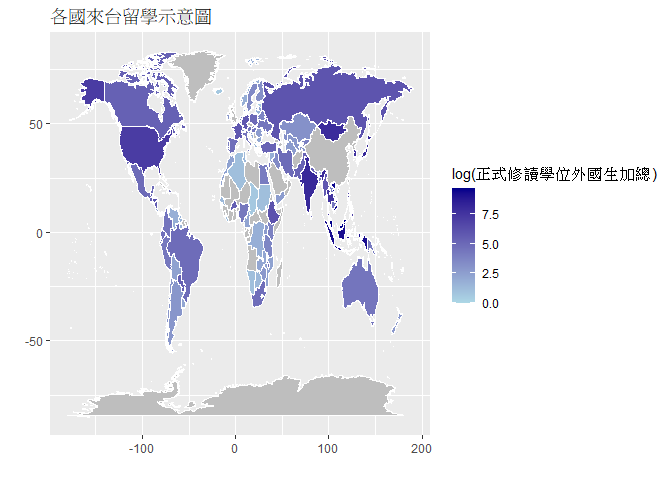

大數據分析方法 分析了解各大專院校國際交流的情形
================


學習再也不限定在自己出生的國家，台灣每年有許多學生選擇就讀國外的大專院校，同時也有人多國外的學生來台灣就讀，透過分析大專校院境外學生人數統計、大專校院本國學生出國進修交流數、世界各主要國家之我國留學生人數統計表可以了解各大專院校國際交流的情形。請同學分析以下議題，並以視覺化的方式呈現分析結果，呈現105-107年以後大專院校國際交流的情形。

## 來台境外生分析

### 資料匯入與處理

``` r
library(dplyr)
```

    ## 
    ## Attaching package: 'dplyr'

    ## The following objects are masked from 'package:stats':
    ## 
    ##     filter, lag

    ## The following objects are masked from 'package:base':
    ## 
    ##     intersect, setdiff, setequal, union

``` r
library(readr)
library(ggplot2)
#
abroad105 <- read_csv("C:/Users/s1042/OneDrive/Desktop/105abroad.csv")
```

    ## Parsed with column specification:
    ## cols(
    ##   洲別 = col_character(),
    ##   國別 = col_character(),
    ##   學位生_正式修讀學位外國生 = col_double(),
    ##   `學位生_僑生(含港澳)` = col_double(),
    ##   學位生_正式修讀學位陸生 = col_double(),
    ##   非學位生_外國交換生 = col_double(),
    ##   非學位生_外國短期研習及個人選讀 = col_double(),
    ##   非學位生_大專附設華語文中心學生 = col_double(),
    ##   非學位生_大陸研修生 = col_double(),
    ##   非學位生_海青班 = col_double(),
    ##   境外專班 = col_double()
    ## )

``` r
abroad106 <- read_csv("C:/Users/s1042/OneDrive/Desktop/106abroad.csv")
```

    ## Parsed with column specification:
    ## cols(
    ##   洲別 = col_character(),
    ##   國別 = col_character(),
    ##   學位生_正式修讀學位外國生 = col_number(),
    ##   `學位生_僑生(含港澳)` = col_number(),
    ##   學位生_正式修讀學位陸生 = col_number(),
    ##   非學位生_外國交換生 = col_double(),
    ##   非學位生_外國短期研習及個人選讀 = col_number(),
    ##   非學位生_大專附設華語文中心學生 = col_number(),
    ##   非學位生_大陸研修生 = col_number(),
    ##   非學位生_海青班 = col_number(),
    ##   境外專班 = col_double()
    ## )

``` r
abroad107 <- read_csv("C:/Users/s1042/OneDrive/Desktop/107abroad.csv")
```

    ## Parsed with column specification:
    ## cols(
    ##   洲別 = col_character(),
    ##   國別 = col_character(),
    ##   學位生_正式修讀學位外國生 = col_double(),
    ##   `學位生_僑生(含港澳)` = col_double(),
    ##   學位生_正式修讀學位陸生 = col_double(),
    ##   非學位生_外國交換生 = col_double(),
    ##   非學位生_外國短期研習及個人選讀 = col_double(),
    ##   非學位生_大專附設華語文中心學生 = col_double(),
    ##   非學位生_大陸研修生 = col_double(),
    ##   非學位生_海青班 = col_double(),
    ##   境外專班 = col_double()
    ## )

``` r
abroad105<-select(abroad105,國別:境外專班,-洲別)
abroad106<-select(abroad106,國別:境外專班,-洲別)
abroad107<-select(abroad107,國別:境外專班,-洲別)
ab1<-full_join(abroad105,abroad106,by="國別")
abroadAll<-full_join(ab1,abroad107,by="國別")
is.numeric(abroadAll$學位生_正式修讀學位外國生.x)
```

    ## [1] TRUE

``` r
is.numeric(abroadAll$學位生_正式修讀學位外國生.y)
```

    ## [1] TRUE

``` r
is.numeric(abroadAll$學位生_正式修讀學位外國生)
```

    ## [1] TRUE

``` r
abroadAll$正式修讀學位外國生加總<-
  abroadAll$學位生_正式修讀學位外國生.x+
  abroadAll$學位生_正式修讀學位外國生.y+
  abroadAll$學位生_正式修讀學位外國生
school105 <- read_csv("C:/Users/s1042/OneDrive/Desktop/105school.csv")
```

    ## Parsed with column specification:
    ## cols(
    ##   學校類型 = col_character(),
    ##   學校代碼 = col_character(),
    ##   學校名稱 = col_character(),
    ##   學位生_正式修讀學位外國生 = col_double(),
    ##   `學位生_僑生(含港澳)` = col_double(),
    ##   學位生_正式修讀學位陸生 = col_double(),
    ##   非學位生_外國交換生 = col_double(),
    ##   非學位生_外國短期研習及個人選讀 = col_double(),
    ##   非學位生_大專附設華語文中心學生 = col_double(),
    ##   非學位生_大陸研修生 = col_double(),
    ##   非學位生_海青班 = col_double(),
    ##   境外專班 = col_double()
    ## )

``` r
school106 <- read_csv("C:/Users/s1042/OneDrive/Desktop/106school.csv")
```

    ## Parsed with column specification:
    ## cols(
    ##   學校類型 = col_character(),
    ##   學校代碼 = col_character(),
    ##   學校名稱 = col_character(),
    ##   學位生_正式修讀學位外國生 = col_double(),
    ##   `學位生_僑生(含港澳)` = col_double(),
    ##   學位生_正式修讀學位陸生 = col_double(),
    ##   非學位生_外國交換生 = col_double(),
    ##   非學位生_外國短期研習及個人選讀 = col_double(),
    ##   非學位生_大專附設華語文中心學生 = col_double(),
    ##   非學位生_大陸研修生 = col_double(),
    ##   非學位生_海青班 = col_double(),
    ##   境外專班 = col_double()
    ## )

``` r
school107 <- read_csv("C:/Users/s1042/OneDrive/Desktop/107school.csv")
```

    ## Parsed with column specification:
    ## cols(
    ##   學校類型 = col_character(),
    ##   學校代碼 = col_character(),
    ##   學校名稱 = col_character(),
    ##   學位生_正式修讀學位外國生 = col_double(),
    ##   `學位生_僑生(含港澳)` = col_double(),
    ##   學位生_正式修讀學位陸生 = col_double(),
    ##   非學位生_外國交換生 = col_double(),
    ##   非學位生_外國短期研習及個人選讀 = col_double(),
    ##   非學位生_大專附設華語文中心學生 = col_double(),
    ##   非學位生_大陸研修生 = col_double(),
    ##   非學位生_海青班 = col_double(),
    ##   境外專班 = col_double()
    ## )

``` r
school105<-select(school105,學校名稱:境外專班,-學校類型|-學校代碼)
school106<-select(school106,學校名稱:境外專班,-學校類型|-學校代碼)
school107<-select(school107,學校名稱:境外專班,-學校類型|-學校代碼)
sch1<-full_join(school105,school106,by="學校名稱")
schAll<-full_join(sch1,school107,by="學校名稱")
is.numeric(schAll$學位生_正式修讀學位外國生.x)
```

    ## [1] TRUE

``` r
is.numeric(schAll$學位生_正式修讀學位外國生.y)
```

    ## [1] TRUE

``` r
is.numeric(schAll$學位生_正式修讀學位外國生)
```

    ## [1] TRUE

``` r
schAll$正式修讀學位外國生加總<-
  schAll$學位生_正式修讀學位外國生.x+
  schAll$學位生_正式修讀學位外國生.y+
  schAll$學位生_正式修讀學位外國生
```

### 哪些國家來台灣唸書的學生最多呢？

``` r
#這是R Code Chunk
TopAbroad<-arrange(abroadAll,desc(正式修讀學位外國生加總))
head(select(TopAbroad,國別,正式修讀學位外國生加總),10)
```

    ## # A tibble: 10 x 2
    ##    國別     正式修讀學位外國生加總
    ##    <chr>                     <dbl>
    ##  1 馬來西亞                  15690
    ##  2 越南                      13749
    ##  3 印尼                      10271
    ##  4 日本                       3546
    ##  5 印度                       3169
    ##  6 蒙古                       2770
    ##  7 南韓                       2183
    ##  8 泰國                       1948
    ##  9 美國                       1296
    ## 10 菲律賓                      867

### 哪間大學的境外生最多呢？

``` r
TopSchool<-arrange(schAll,desc(正式修讀學位外國生加總))
head(select(TopSchool,學校名稱,正式修讀學位外國生加總),10)
```

    ## # A tibble: 10 x 2
    ##    學校名稱         正式修讀學位外國生加總
    ##    <chr>                             <dbl>
    ##  1 國立臺灣大學                       2547
    ##  2 國立成功大學                       2457
    ##  3 銘傳大學                           2381
    ##  4 國立臺灣科技大學                   2203
    ##  5 義守大學                           2178
    ##  6 國立臺灣師範大學                   1751
    ##  7 國立交通大學                       1656
    ##  8 淡江大學                           1615
    ##  9 逢甲大學                           1602
    ## 10 開南大學                           1601

### 各個國家來台灣唸書的學生人數長條圖

``` r
ggplot()+geom_bar(data=abroadAll,
                  aes(x=國別,y=正式修讀學位外國生加總),
                  stat="identity") +coord_flip()
```

    ## Warning: Removed 33 rows containing missing values (position_stack).

<!-- -->

### 各個國家來台灣唸書的學生人數面量圖

``` r
#這是R Code Chunk
```

## 台灣學生國際交流分析

### 資料匯入與處理

``` r
library(maps)
library(mapdata)
library(readxl)
library(purrr)
```

    ## 
    ## Attaching package: 'purrr'

    ## The following object is masked from 'package:maps':
    ## 
    ##     map

``` r
library(plotly)
```

    ## 
    ## Attaching package: 'plotly'

    ## The following object is masked from 'package:ggplot2':
    ## 
    ##     last_plot

    ## The following object is masked from 'package:stats':
    ## 
    ##     filter

    ## The following object is masked from 'package:graphics':
    ## 
    ##     layout

``` r
TWstu <- read_csv("C:/Users/s1042/OneDrive/Desktop/TWstu.csv")
```

    ## Parsed with column specification:
    ## cols(
    ##   學年度 = col_double(),
    ##   學期 = col_double(),
    ##   設立別 = col_character(),
    ##   學校類別 = col_character(),
    ##   學校統計處代碼 = col_character(),
    ##   學校名稱 = col_character(),
    ##   系所代碼 = col_character(),
    ##   系所名稱 = col_character(),
    ##   `學制班別(日間)` = col_character(),
    ##   `進修交流國家(地區)別` = col_character(),
    ##   `進修交流國家(地區)區域別` = col_character(),
    ##   `本國學生出國進修交流至少1學期(修讀學分)以上人數小計` = col_double(),
    ##   `本國學生出國進修交流至少1學期(修讀學分)以上人數男` = col_double(),
    ##   `本國學生出國進修交流至少1學期(修讀學分)以上人數女` = col_double(),
    ##   `本國學生出國進修交流未滿1學期(修讀學分)人數小計` = col_double(),
    ##   `本國學生出國進修交流未滿1學期(修讀學分)人數男` = col_double(),
    ##   `本國學生出國進修交流未滿1學期(修讀學分)人數女` = col_double()
    ## )

``` r
is.numeric(TWstu$`本國學生出國進修交流至少1學期(修讀學分)以上人數小計`)
```

    ## [1] TRUE

``` r
is.numeric(TWstu$`本國學生出國進修交流未滿1學期(修讀學分)人數小計`)
```

    ## [1] TRUE

``` r
TWstu$學生交換總人數<-
  TWstu$`本國學生出國進修交流至少1學期(修讀學分)以上人數小計`+
  TWstu$`本國學生出國進修交流未滿1學期(修讀學分)人數小計`
world_map = map_data("world")
countryName = read_excel("C:\\Users\\s1042\\OneDrive\\Desktop\\regionchange.xls")
countryName = countryName[c(-2, -4)]
names(countryName)[2]  = "國別"
countryAll = left_join(TopAbroad, countryName, by = "國別")
countryAll$英文國名簡稱[countryAll$國別 == '大陸地區'] = 'China'
countryAll$英文國名簡稱[countryAll$國別 == '美國'] = 'USA'
countryAll$英文國名簡稱[countryAll$國別 == '日本'] = 'Japan'
countryAll$英文國名簡稱[countryAll$國別 == '香港'] = 'Hong Kong'
countryAll$英文國名簡稱[countryAll$國別 == '南韓'] = 'South Korea'
countryAll$英文國名簡稱[countryAll$國別 == '澳大利亞']= 'Australia'
countryAll$英文國名簡稱[countryAll$國別 =='聖文森']= 'Saint Vincent'
countryAll$英文國名簡稱[countryAll$國別 =='索羅門群島']= 'Solomon Islands'
countryAll$英文國名簡稱[countryAll$國別 =='馬紹爾群島共和國'] = 'Republic of the Marshall Islands'
countryAll$英文國名簡稱[countryAll$國別 =='巴布亞紐幾內亞'] = 'Papua New Guinea'
countryAll$英文國名簡稱[countryAll$國別 =='聖多美普林西比'] = 'Sao Tome and Principe'
countryAll$英文國名簡稱[countryAll$國別 =='巴勒斯坦'] = 'Palestine'
countryAll$英文國名簡稱[countryAll$國別 =='塞爾維亞共和國'] = 'Republic of Serbia'
countryAll$英文國名簡稱[countryAll$國別 =='沙烏地阿拉伯'] = 'Saudi Arabia'
countryAll$英文國名簡稱[countryAll$國別 =='剛果民主共和國'] = 'Democratic Republic of the Congo'
countryAll$英文國名簡稱[countryAll$國別 =='科索沃共和國'] = 'Kosovo Republic'
countryAll$英文國名簡稱[countryAll$國別 =='索馬利蘭共和國'] = 'Somaliland'
countryAll$英文國名簡稱[countryAll$國別 =='阿拉伯聯合大公國'] = 'United Arab Emirates'
countryAll$英文國名簡稱[countryAll$國別 =='波士尼亞與赫塞哥維納'] = 'Bosnia and Herzegovina'
countryAll$英文國名簡稱[countryAll$國別 =='獅子山共和國'] = 'Lion Rock Republic'

world_DT = full_join(countryAll, world_map, by = c("英文國名簡稱" = "region") )
```

### 台灣大專院校的學生最喜歡去哪些國家進修交流呢？

``` r
group_by(TWstu,`進修交流國家(地區)別`)%>%
  summarise(台灣學生交換之總數=n()) %>%
  arrange(desc(台灣學生交換之總數))
```

    ## # A tibble: 82 x 2
    ##    `進修交流國家(地區)別` 台灣學生交換之總數
    ##    <chr>                               <int>
    ##  1 大陸地區                             4063
    ##  2 日本                                 3125
    ##  3 大韓民國(南韓)                       2080
    ##  4 美國                                 1839
    ##  5 德意志聯邦共和國                     1520
    ##  6 法國                                 1006
    ##  7 荷蘭王國                              589
    ##  8 捷克共和國                            531
    ##  9 西班牙王國                            500
    ## 10 加拿大                                482
    ## # ... with 72 more rows

### 哪間大學的出國交流學生數最多呢？

``` r
group_by(TWstu,學校名稱)%>%
  summarise(台灣學生交換之總數=n()) %>%
  arrange(desc(台灣學生交換之總數))
```

    ## # A tibble: 140 x 2
    ##    學校名稱         台灣學生交換之總數
    ##    <chr>                         <int>
    ##  1 國立臺灣大學                   2064
    ##  2 國立政治大學                   1667
    ##  3 國立交通大學                    729
    ##  4 國立清華大學                    705
    ##  5 國立臺灣師範大學                614
    ##  6 淡江大學                        608
    ##  7 國立中山大學                    587
    ##  8 輔仁大學                        524
    ##  9 靜宜大學                        502
    ## 10 國立臺灣科技大學                481
    ## # ... with 130 more rows

### 台灣大專院校的學生最喜歡去哪些國家進修交流條狀圖

``` r
ggplot()+geom_bar(data=TWstu,
                  aes(x=學校名稱,y=學生交換總人數),
                  stat="identity") +coord_flip()
```

<!-- -->

### 台灣大專院校的學生最喜歡去哪些國家進修交流面量圖

``` r
world_map_goinside <- ggplot(world_DT, aes(x = long, y = lat, group = group, fill = log(正式修讀學位外國生加總))) +
  geom_polygon(colour = "white") +
  scale_fill_gradient(low = "lightblue", high = "darkblue", na.value = "gray") +
  labs(title = "各國來台留學示意圖", x = "", y = "") +
  theme(text=element_text(family = "Kaiti TC Regular"))

world_map_goinside
```

    ## Warning in grid.Call(C_stringMetric, as.graphicsAnnot(x$label)): font family not
    ## found in Windows font database
    
    ## Warning in grid.Call(C_stringMetric, as.graphicsAnnot(x$label)): font family not
    ## found in Windows font database

    ## Warning in grid.Call(C_textBounds, as.graphicsAnnot(x$label), x$x, x$y, : font
    ## family not found in Windows font database

    ## Warning in grid.Call(C_stringMetric, as.graphicsAnnot(x$label)): font family not
    ## found in Windows font database

    ## Warning in grid.Call(C_textBounds, as.graphicsAnnot(x$label), x$x, x$y, : font
    ## family not found in Windows font database
    
    ## Warning in grid.Call(C_textBounds, as.graphicsAnnot(x$label), x$x, x$y, : font
    ## family not found in Windows font database
    
    ## Warning in grid.Call(C_textBounds, as.graphicsAnnot(x$label), x$x, x$y, : font
    ## family not found in Windows font database
    
    ## Warning in grid.Call(C_textBounds, as.graphicsAnnot(x$label), x$x, x$y, : font
    ## family not found in Windows font database
    
    ## Warning in grid.Call(C_textBounds, as.graphicsAnnot(x$label), x$x, x$y, : font
    ## family not found in Windows font database
    
    ## Warning in grid.Call(C_textBounds, as.graphicsAnnot(x$label), x$x, x$y, : font
    ## family not found in Windows font database
    
    ## Warning in grid.Call(C_textBounds, as.graphicsAnnot(x$label), x$x, x$y, : font
    ## family not found in Windows font database
    
    ## Warning in grid.Call(C_textBounds, as.graphicsAnnot(x$label), x$x, x$y, : font
    ## family not found in Windows font database
    
    ## Warning in grid.Call(C_textBounds, as.graphicsAnnot(x$label), x$x, x$y, : font
    ## family not found in Windows font database
    
    ## Warning in grid.Call(C_textBounds, as.graphicsAnnot(x$label), x$x, x$y, : font
    ## family not found in Windows font database
    
    ## Warning in grid.Call(C_textBounds, as.graphicsAnnot(x$label), x$x, x$y, : font
    ## family not found in Windows font database
    
    ## Warning in grid.Call(C_textBounds, as.graphicsAnnot(x$label), x$x, x$y, : font
    ## family not found in Windows font database
    
    ## Warning in grid.Call(C_textBounds, as.graphicsAnnot(x$label), x$x, x$y, : font
    ## family not found in Windows font database

<!-- -->

## 台灣學生出國留學分析

### 資料匯入與處理

``` r
worldTw <- read_csv("C:/Users/s1042/OneDrive/Desktop/worldTw.csv")
```

    ## Parsed with column specification:
    ## cols(
    ##   年度 = col_double(),
    ##   洲別 = col_character(),
    ##   國別 = col_character(),
    ##   總人數 = col_number()
    ## )

### 台灣學生最喜歡去哪些國家留學呢？

``` r
group_by(worldTw,國別)%>%
  summarise(總人數=sum(總人數))%>%
  arrange(desc(總人數))
```

    ## # A tibble: 49 x 2
    ##    國別     總人數
    ##    <chr>     <dbl>
    ##  1 美國      63770
    ##  2 澳大利亞  30155
    ##  3 日本      28433
    ##  4 加拿大    13359
    ##  5 英國      11510
    ##  6 德國       5256
    ##  7 紐西蘭     2926
    ##  8 法國       2083
    ##  9 波蘭       2077
    ## 10 馬來西亞   1513
    ## # ... with 39 more rows

### 台灣學生最喜歡去哪些國家留學面量圖

``` r
#這是R Code Chunk
```

## 綜合分析

請問來台讀書與離台讀書的來源國與留學國趨勢是否相同(5分)？想來台灣唸書的境外生，他們的母國也有很多台籍生嗎？請圖文並茂說明你的觀察(10分)。
在我看來有些許不同，台灣大專院校的學生較多是選擇鄰近地區的國家或是在國際情勢上較具優勢並且具有影響力的國家，像是中國、日本、韓國、美國、歐洲等國家；而來台留學的外籍生較多為鄰近國家居多，像是馬來西亞、越南、印尼、日本等國家，而較多屬於開發中國家，來台留學之國家前幾名較不屬於經濟極為興盛的國家。

以境外生來台之第一名的國家馬來西亞來看，105-107年我國至馬來西亞之留學生總人數為1513人，遠遠低於馬來西亞學生來台的人數15960人；而以境外生來台之第二名的國家越南來看，105-107年我國至越南之留學生總人數為578人，遠遠低於越南學生來台的人數13749人；最後以境外生來台之第三名的國家印尼來看，105-107年我國至越南之留學生總人數為251人，依然遠遠低於越南學生來台的人數10271人。
